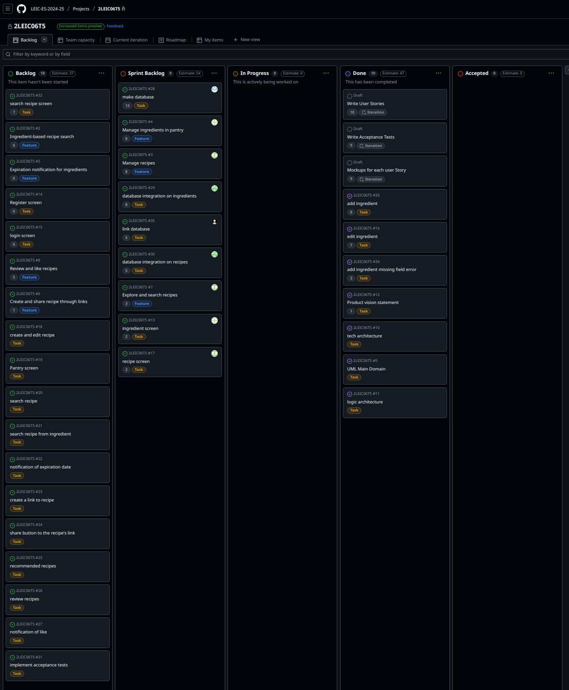
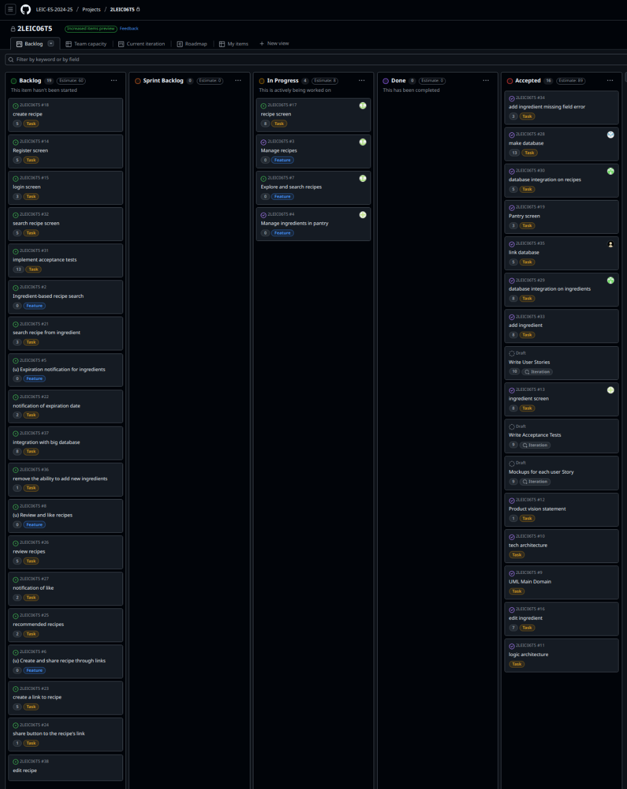

# 2LEIC06T5
# MyPantry Development Report

Welcome to the documentation pages of MyPantry!

This Software Development Report, tailored for LEIC-ES-2024-25, provides comprehensive details about MyPantry, from high-level vision to low-level implementation decisions. It’s organised by the following activities. 

* [Business modeling](#Business-Modelling) 
  * [Product Vision](#Product-Vision)
  * [Features and Assumptions](#Features-and-Assumptions)
  * [Elevator Pitch](#Elevator-pitch)
* [Requirements](#Requirements)
  * [User stories](#User-stories)
  * [Domain model](#Domain-model)
* [Architecture and Design](#Architecture-And-Design)
  * [Logical architecture](#Logical-Architecture)
  * [Physical architecture](#Physical-Architecture)
  * [Vertical prototype](#Vertical-Prototype)
* [Project management](#Project-Management)
  * [Sprint 0](#Sprint-0)
  * [Sprint 1](#Sprint-1)
  * [Sprint 2](#Sprint-2)
  * [Sprint 3](#Sprint-3)
  * [Sprint 4](#Sprint-4)
  * [Final Release](#Final-Release)
* [Changelog](#Changelog)
  * [Links](#Links)
  * [Final Version](#Final-Version)
  * [Version Beta3](#Version-Beta-3)
  * [Version Beta2](#Version-Beta-2)
  * [Version Beta1](#Version-Beta-1)

Contributions are expected to be made exclusively by the initial team, but we may open them to the community, after the course, in all areas and topics: requirements, technologies, development, experimentation, testing, etc.

Please contact us!

Thank you!

* Catarina Bastos - up202307631@up.pt
* Martim Neves - up202305501@up.pt
* Nuno Costa - up202305503@up.pt
* Tomás Salgueiro - up202305511@up.pt
* Vasco Gonçalves - up202305513@up.pt

Happiness Meters: https://docs.google.com/spreadsheets/d/1bpWW_ZRRbIz7GMFMqGFUHWIFmTvyJjObP3k4dKl94EQ/edit?usp=sharing

---
## Business Modelling

Business modeling in software development involves defining the product's vision, understanding market needs, aligning features with user expectations, and setting the groundwork for strategic planning and execution.

### Product Vision

MyPantry is an app used to manage the items on your pantry, reduce waste and also make use of them searching for new recipes or even sharing your own. You will never have to wonder if you still have this or that at home, your pantry will always be in your pocket.
In the future, we aim to enlarge our user base and become a meeting point to all types off foodies who want to create, share and explore!
More over we want to make it simpler for you in the kitchen.

### Features and Assumptions
<!-- 
Indicate an  initial/tentative list of high-level features - high-level capabilities or desired services of the system that are necessary to deliver benefits to the users.
 - Feature XPTO - a few words to briefly describe the feature
 - Feature ABCD - ...
...

Optionally, indicate an initial/tentative list of assumptions that you are doing about the app and dependencies of the app to other systems.
-->

### Elevator Pitch
<!-- 
Draft a small text to help you quickly introduce and describe your product in a short time (lift travel time ~90 seconds) and a few words (~800 characters), a technique usually known as elevator pitch.

Take a look at the following links to learn some techniques:
* [Crafting an Elevator Pitch](https://www.mindtools.com/pages/article/elevator-pitch.htm)
* [The Best Elevator Pitch Examples, Templates, and Tactics - A Guide to Writing an Unforgettable Elevator Speech, by strategypeak.com](https://strategypeak.com/elevator-pitch-examples/)
* [Top 7 Killer Elevator Pitch Examples, by toggl.com](https://blog.toggl.com/elevator-pitch-examples/)
-->

## Requirements

### User Stories
<!-- 
In this section, you should describe all kinds of requirements for your module: functional and non-functional requirements.

For LEIC-ES-2024-25, the requirements will be gathered and documented as user stories. 

Please add in this section a concise summary of all the user stories.

**User stories as GitHub Project Items**
The user stories themselves should be created and described as items in your GitHub Project with the label "user story". 

A user story is a description of a desired functionality told from the perspective of the user or customer. A starting template for the description of a user story is *As a < user role >, I want < goal > so that < reason >.*

Name the item with either the full user story or a shorter name. In the “comments” field, add relevant notes, mockup images, and acceptance test scenarios, linking to the acceptance test in Gherkin when available, and finally estimate value and effort.

**INVEST in good user stories**. 
You may add more details after, but the shorter and complete, the better. In order to decide if the user story is good, please follow the [INVEST guidelines](https://xp123.com/articles/invest-in-good-stories-and-smart-tasks/).

**User interface mockups**.
After the user story text, you should add a draft of the corresponding user interfaces, a simple mockup or draft, if applicable.

**Acceptance tests**.
For each user story you should write also the acceptance tests (textually in [Gherkin](https://cucumber.io/docs/gherkin/reference/)), i.e., a description of scenarios (situations) that will help to confirm that the system satisfies the requirements addressed by the user story.

**Value and effort**.
At the end, it is good to add a rough indication of the value of the user story to the customers (e.g. [MoSCoW](https://en.wikipedia.org/wiki/MoSCoW_method) method) and the team should add an estimation of the effort to implement it, for example, using points in a kind-of-a Fibonnacci scale (1,2,3,5,8,13,20,40, no idea).

-->
As a registered user, I want to see other people's recipes so that I can get inspiration.

As a registered user, I want to rate other people's recipes so that they what I think about it.

As a registered user, I want to be able to change the app's settings.

As a registered user, I want to be notified when the ingredients are about to expire so that I can manage the stock easier.

As a registered user, I want to search recipes so that I can cook with the ingredients I have.

As a registered user, I want to manage privately or public (create and save) recipes so that I can remember them later.

As a registered user, I want to add and consume my ingredients (name,expiration date, count, calories) so that I know what I have.

As a registered user, I want create a link and share recipes so that people can access them as well.

### Domain model

## Architecture and Design
<!--
The architecture of a software system encompasses the set of key decisions about its organization. 

A well written architecture document is brief and reduces the amount of time it takes new programmers to a project to understand the code to feel able to make modifications and enhancements.

To document the architecture requires describing the decomposition of the system in their parts (high-level components) and the key behaviors and collaborations between them. 

In this section you should start by briefly describing the components of the project and their interrelations. You should describe how you solved typical problems you may have encountered, pointing to well-known architectural and design patterns, if applicable.
-->

### Logical architecture

### Physical architecture

### Vertical prototype
<!--
To help on validating all the architectural, design and technological decisions made, we usually implement a vertical prototype, a thin vertical slice of the system integrating as much technologies we can.

In this subsection please describe which feature, or part of it, you have implemented, and how, together with a snapshot of the user interface, if applicable.

At this phase, instead of a complete user story, you can simply implement a small part of a feature that demonstrates thay you can use the technology, for example, show a screen with the app credits (name and authors).
-->

## Project management
<!--
Software project management is the art and science of planning and leading software projects, in which software projects are planned, implemented, monitored and controlled.

In the context of ESOF, we recommend each team to adopt a set of project management practices and tools capable of registering tasks, assigning tasks to team members, adding estimations to tasks, monitor tasks progress, and therefore being able to track their projects.

Common practices of managing agile software development with Scrum are: backlog management, release management, estimation, Sprint planning, Sprint development, acceptance tests, and Sprint retrospectives.

You can find below information and references related with the project management: 

* Backlog management: Product backlog and Sprint backlog in a [Github Projects board](https://github.com/orgs/FEUP-LEIC-ES-2023-24/projects/64);
* Release management: [v0](#), v1, v2, v3, ...;
* Sprint planning and retrospectives: 
  * plans: screenshots of Github Projects board at begin and end of each Sprint;
  * retrospectives: meeting notes in a document in the repository, addressing the following questions:
    * Did well: things we did well and should continue;
    * Do differently: things we should do differently and how;
    * Puzzles: things we don’t know yet if they are right or wrong… 
    * list of a few improvements to implement next Sprint;

-->

### Sprint 0

### Sprint 1

#### Planning
 

#### Completion
 

#### Retrospective
 During the sprint we:
 - had 3 main issues to complete and we completed 2 of them plus a considerably part of the 3rd
 - were able to complete tasks that correlated work of 2 elements of the group
 - were able to merge our solo progress without problems
   
 Also had points to improve:
 - couldn't complete all that we planned
 - poor time management

 To improve we could:
 - do a group meeting and work on the project at the same time
 - keep a close eye on the solo progress of the others to get a better insight on the project as a whole

### Sprint 2

#### Planning
 

#### Completion

#### Retrospective
 During the sprint we:
 - Made good progress in every feauture and task we planned for this sprint
   
 Also had points to improve:
 - had little attention to details that compromised the completion of some tasks

 To improve we could:
 - put ourselves in the user point of view to target every little detail
 
### Sprint 3

#### Planning

#### Completion

#### Retrospective
 During the sprint we:
 - Completed all the main features of the app
   
 Also had points to improve:
 - We should've taken a client's point of view to realize some mistakes that were done.

 To improve we could:
 - Have someone enter the app with the intention of really using it to have a better insight to what we need to improve

### Sprint 4

#### Planning

### Final Release

# Changelog
## Links
- FinalVersion: [https://github.com/LEIC-ES-2024-25/2LEIC06T5/releases/tag/FinalRelease]
- Beta3: [https://github.com/LEIC-ES-2024-25/2LEIC06T5/releases/tag/Version3]
- Beta2: [https://github.com/LEIC-ES-2024-25/2LEIC06T5/releases/tag/Version2]
- Beta1: [https://github.com/LEIC-ES-2024-25/2LEIC06T5/releases/tag/Beta_Version1]

## Final Version

### Added

- The user must type their previous password in order to change it
  
### Changed
- Database refactor: The logic and code to get database data is much more clean, and it's easier to mock it
- The screen to display a recipe has a better UI
- The widget to filter recipes by ingredients now has a search bar where the user can search for the ingredients they want, instead of displaying everything
- The pantry's code was refactored, the logic is separated to the UI

### Fixed
- Opening a recipe by a link no longer displays it on top of the rest of the screens (when the app was already open)

## Version Beta 3

### Added

- The session is now kept, meaning that if they login and close the app, they don't need to login again
- The user is now able to share recipes with a link that, when open, opens the app on the respective recipe screen
- Searching for a ingredient now displays "Searching" and a throbber while loading
- Display "No ingredients in the pantry" when the user doesn't have ingredients in their pantry
- Display a throbber on the pantry while it's loading
- The user is able to like a recipe
- The user is able to save recipes
- The recipes screen now has the tabs for "Search", "Saved" and "My Recipes" that filter recipes based on the text input, recipes that are marked as saved, and recipes from the user, respectively
- Settings menu, where the user can log out, delete their account and change their name, email or password
- Users can now comment on recipes
- The difficulty slider on the recipe creation screen has a label that displays the currently selected value
- The user can now pick a date to notify them about the expiration of an ingredient (or more than one)
- The owner of a recipe can delete comments on that recipe
- An image can be added to a recipe, that is then displayed on both it's preview and complete recipe screen

### Changed

- Registring now redirects the user directly to the app, not to the login screen
- Search results on the recipes search are now case insensitive
- Design revamp in the whole app, aside from the login screen

### Fixed

- Edit an ingredient and changing the ingredient itself wasn't working
- Overflow on ingredients with big names
- Overflow on some recipe previews
- Recipe creation and editing

### Removed

- The user isn't able to change the calories value of an ingredient

## Version Beta 2

### Added

- The user can now register their account
- The user is able to enter their existing account
- The user is able to log out 
- Each user has their own pantry
- Filter recipes by ingredients that are on the user's pantry
- Recipes have likes
- The recipes are sorted by likes on the menu
- When tapping a recipe on the recipes screen, a screen with the complete description of that recipe displays
  
### Fixed

- The pantry items now correctly display the ingredient's image

### Removed

- The users can no longer add ingredients that aren't on the database, meaning they only have access to the ones that already are

## Version Beta 1

### Added

- Autocomplete while adding the ingredient, given the ingredients on the database
- Database Integration : Adding/Modifying/Removing ingredients is now persistent 
- Recipes Screen with a list of recipes
- Database Integration with recipes : The list of recipes is fetched from the database
- When tapping an ingredient on the pantry, a screen with information about the ingredient displays
- Search bar on the recipes screen, that allows to look for recipes by name

### Changed

- Instead of editing the ingredients on tap, there's a proper button for it
- The bottom navigation bar design was changed

